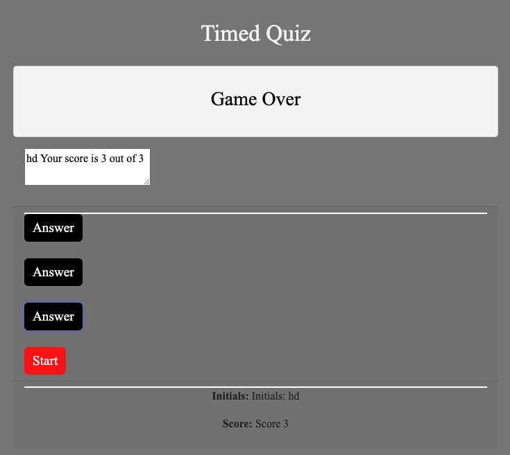

# Quiz
Creating a timed quiz
This project was about creating a quiz.

We had to create this quiz from scratch.
Created an HTML document, a css, and javascript.
Originally titiled the html page as quiz.html. This was not working with git hub, to display the web page. I couldn't get that to work so I had to delete the repo and create a new one.
I will have to remember to title each page as index.html
I created 3 questions for the quiz, and gave a 20 second timer. Each wrong answer deletes two seconds and does not let you move forward until you have answered correctly. 
The score and initials are stored in the local memory and also displayed on the screen.

I did this by creating a series of functions

a function to update the timer

a function to start a timer. this function also resets the buttons, and asks for your initials to be saved. this leads to the function that handles the first question.

each other question is also a separate function. these functions include "remove even listener functions 

there is also a function to handle what happens when the correct answer is selected

there is also a function to handle what happens when the incorrect answer is selected

Below is a screen shot of the quiz online

Below is a link to the repository 
https://github.com/HectorDiazJr/Quiz

Below is al link to the quiz 
https://hectordiazjr.github.io/Quiz/